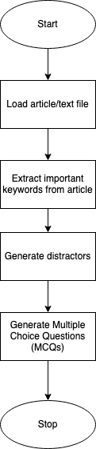
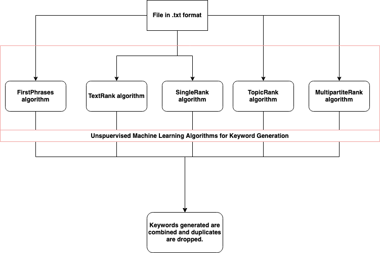
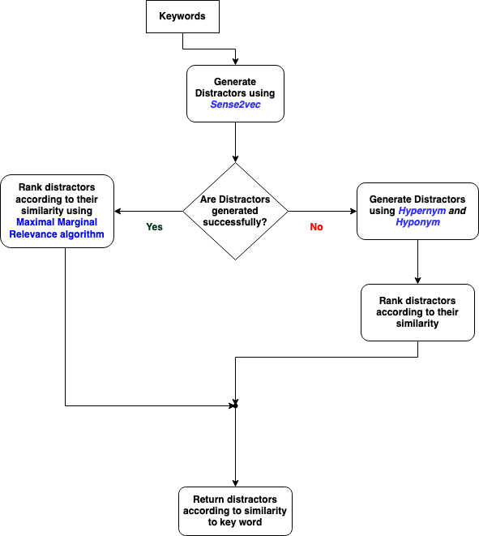

# Multiple Question Generator using NLP

## Introduction
Multiple Choice Questions (MCQs) also known as multiple choice tests are frequently used in a variety of educational and evaluation contexts since their assessment can be automated [1]. They significantly simplify the testing process for both test-takers and examiners. Also, MCQs have proven to be relevant and objective indicators of the learner skills. However, creating multiple choice questions is expensive, and the quality of MCQ is crucial in order to ensure that learners will perform according to their skills. Quality MCQs can be produced with the aid of certain guidelines [2]. A MCQ is composed of two parts (see example below): the stem and the options (or choices), which include both the answer (correct option), and one or several distractors (incorrect options).
Stem: What continent is Luxembourg located in? Answer: Europe
Distractors: Africa, America, Asia
Manual generation of MCQs is a very expensive and time-consuming task and yet they often need to be produced on a large scale and within short iterative cycles. To address this issue, we present an automated multiple-choice question generation system. When given an article as an input, the system creates question–answer pairs together with additional incorrect options (distractors). The produced questions could also be utilised for self-assessment and knowledge gap identification, allowing instructors to adjust their course material accordingly. It is particularly well suited for a classroom environment. It can also be used in the business world to create questions to improve the onboarding process, to improve the content of massive open online courses (MOOCs), or to provide data to train chatbots or question-answering systems.

## Related Work
[3] an unsupervised dependency-based method for extracting semantic relations that can be used in the context of multiple choice question production automatically (MCQs). [4] reports on an automatic generation tool for Fill-in-the-Blank Questions (FBQ) for Italian. [5] describes a method for generating multiple choice questions together with the Item Response Theory based testing to measure English proficiency. [6] uses a variety of methods, including term extraction and parsing, to create MCQs. Finally, [7] reports a machine learning approach for the automatic generation of such types of questions.

## Methodology

Figure 1: MCQ generation pipeline

## Load data
To generate MCQs, our work is capable of taking any article in a .txt file format and loading it.

## Extract Important Keywords
The key is the word or phrase to be blanked in the Multiple Choice Question (MCQ). Extracting keywords manually from a piece of text is a time-consuming task that would also require domain expertise. Luckily, there has been a hike in the level of interest in automatic keyphrase extraction in the field of Natural Language Processing (NLP). This has led to a number of diverse approaches. For our work, we compare 5 Unsupervised Keyphrase Extraction algorithms implemented in the PKE python package [8]. One important thing about these algorithms is that they do not require domain knowledge i.e. they do need to have been trained with similar text data to be able to learn and generate keywords when provided text. They include;
1. First Phrases: simple algorithm that extracts the first phrases of a document.
2. Text Rank: is a graph-based ranking model for text processing which can be used in order to find the most relevant sentences in text and also to find keywords [9]. In order to find relevant keywords, the textrank algorithm constructs a word network. This network is constructed by looking at which words follow one another. A link is set up between two words if they follow one another, the link gets a higher weight if these 2 words occur more frequently next to each other in the text. On top of the resulting network the Pagerank algorithm is applied to get the importance of each word. The top 1/3 of all these words are kept and are considered relevant. After this, a keywords table is constructed by combining the relevant words together if they appear
following one another in the text.
3. Single Rank: The algorithm builds a global affinity graph G based on all candidate
words restricted by syntactic filters in the document [10]. It then employs the graph-ranking based algorithm to compute the cluster-level saliency score for each word. The words with the highest score are selected.
4. Topic Rank: this is a graph-based keyphrase extraction method that relies on a topical representation of the document [11]. Candidate keyphrases are clustered into topics and used as vertices in a complete graph. A graph-based ranking model is applied to assign a significance score to each topic. Keyphrases are then generated by selecting a candidate from each of the top-ranked topics.
5. Multipartite Rank: This method is an unsupervised keyphrase extraction model that encodes topical information within a multipartite graph structure. This model represents keyphrase candidates and topics in a single graph and then exploits their mutually reinforcing relationship to improve candidate ranking [12].

### Combine Keywords Extracted
Upon inspection of the results of the models, we notice that the output returned by the models were a bit similar in some cases. Since reference keywords (annotated by experts) are needed to evaluate the keywords generated, we skipped this part since it is out of the scope of this project to generate reference keywords. We went ahead to combine all distinct keywords generated from the 5 unsupervised models [9][10][11][12] to be used for MCQ generation.

Figure 2: Keyword generation pipeline

## Split Article
Split the entire text article into an array/list of individual sentences. This process will enable us to easily fetch the sentences related to each keyword. While splitting sentences, we remove sentences that have length less than 15 i.e. sentences that are too brief. We do this so that we can ensure that our questions have enough length for context.

### Map sentences to keywords
Using the FlashText algorithm [13], we automatically map all generated keywords to the respective sentences that contain them and store the results in a python dictionary. We use the FlashText algorithm because it can search or replace keywords in one pass over a document. The time complexity of this algorithm is not dependent on the number of terms being searched or replaced. For a document of size N (characters) and a dictionary of M keywords, the time complexity will be O(N). This algorithm is much faster than Regex, because regex time complexity is O(MxN).

## Distractor Generation
Distractors are “options” in MCQs. Distractors are alternative answers used to distract students from the correct answer [14]. Finding reasonable distractors is very crucial to our task. Rather than generate trivial wrong answers, the goal when generating distractors is to generate plausible false answers - good distractors. Specifically, a “good” distractor should be at least semantically related to the key. Example: A question such as “What is the longest river in Africa?” could have distractors such as: Congo River, River Niger, White Nile while the original answer would be River Nile.
We generate distractors by combining two approaches;
1) Sense2vec: Sense2vec is a neural network model that generates vector space
representations of words from large corpora [15]. It is an extension of the word2vec [16] algorithm. Sense2vec creates embeddings for ”senses” rather than tokens of words. A sense is a word combined with a label i.e. the information that represents the context in which the word is used. Using sense2vec python package, we generate distractors then rank them according to similarity with the keyword. We use the Maximal Marginal Relevance algorithm to measure this similarity. Words with higher similarity are better distractors since they will be harder to decode in exams.
In cases where we are unable to generate distractors using the Sense2vec algorithm,
we use the next approach.
2) Hypernym-Hyponym approach: Hypernym is a word with a broad meaning
constituting a category into which words with more specific meanings fall. For example, colour is a hypernym of red, machine is a hypernym of computer, animal is a hypernym of dog. A hyponym on the other hand is a more specific term. Hyponyms are subordinates of a Hypernym. Putting it all together; If Red is our keyword, the hypernym of red is colour and a hyponym of red is yellow or green or blue. This approach works the following way:
    ● We find the sense of the keyword in the sentence based on Word-sense disambiguation and Adapted Lesk algorithm. These algorithms have already been implemented on the pywsd [17] python package.
    ● After getting the sense of the word, we find the hypernym of that word.
    ● Using the hypernym, we find all hyponyms. For example, using machine as a hypernym, we find hyponyms such as: assembly, bagger, calculator, calendar, decoder, machinery etc. These hyponyms will be used as the distractors. We rank these hyponyms in order of their similarity to the keyword. The most similar (the best distractors) appear first.

Figure 3: Distractor generation pipeline

## MCQ Generation
Using each sentence and the generated distractors, we then develop the MCQs. These MCQs are returned in an exam format on a .txt file that can then be used by the examiner etc.

## Conclusion
A system to create multiple-choice questions from text has been presented. This system can be used as a self-assessment tool or to identify knowledge gaps in both a classroom environment and an industrial context. It can also be linked into other systems.
In future, we plan to improve our work in the following way: Currently, our model returns questions exactly how they appear in the article. Future work would involve efficiently paraphrasing generated MCQs to make questions tougher.

## References
1. Haladyna, T.M., Downing, S.M., Rodriguez, M.C.: A review of multiple-choice item-writing guidelines for classroom assessment. Applied measurement in education 15(3), 309–333 (2002).
2. Burton, S.J., Sudweeks, R.R., Merrill, P.F., Wood, B.: How to prepare better multiple-choice test items: Guidelines for university faculty (1991).
3. Afzal N, Mitkov R. 2014. Automatic generation of multiple choice questions using dependency based semantic relations. Soft Computing 18(7): 1269–1281.
4. Kraift, O., Antoniadis, G., Echinard, S., Loiseau, M., Lebarbé T., Ponton C.: NLP Tools for CALL: the Simpler, the Better. Proceedings of the InSTIL/ICALL2004 – NLP and Speech Technologies in Advanced Language Learning Systems, Venice. (2004).
5. Sumita, E., Sugaya, F., Yamamota, S.: Measuring Non-native Speakers’ Proficiency of English by Using a Test with Automatically-Generated Fill-in-the Blank Questions. Proceedings of the 2nd Workshop on Building Educational Applications Using NLP, Ann Arbor. (2005) 61-68.
6. Mitkov, R., An, L.: Computer-aided generation of multiple-choice tests. Proceedings of the 1st Workshop on Building Educational Applications Using NLP. HLT-NAACL. (2003) 17-22.
7. Hoshino, A., Nakagawa, H.: A real-time multiple-choice question generation for language testing. Proceedings of the 2nd Workshop on Building Educational Applications Using NLP, Ann Arbor. (2005) 17-20.
8. Boudin, Florian: pke: an open source python-based keyphrase extraction toolkit. Proceedings of COLING 2016, the 26th International Conference on Computational Linguistics: System Demonstrations. (2006) 69-73.
9. Mihalcea, Rada, and Paul Tarau. "Textrank: Bringing order into text." Proceedings of the 2004 conference on empirical methods in natural language processing. 2004.
10. Wan, Xiaojun, and Jianguo Xiao. "CollabRank: towards a collaborative approach to single-document keyphrase extraction." Proceedings of the 22nd International Conference on Computational Linguistics (Coling 2008). 2008.
11. Bougouin, Adrien, Florian Boudin, and Béatrice Daille. "Topicrank: Graph-based topic ranking for keyphrase extraction." International joint conference on natural language processing (IJCNLP). 2013.
12. Boudin, Florian. "Unsupervised keyphrase extraction with multipartite graphs." arXiv preprint arXiv:1803.08721 (2018).
13. Singh, Vikash. "Replace or retrieve keywords in documents at scale." arXiv preprint arXiv:1711.00046 (2017).
14. Liang, Chen, et al. "Distractor generation for multiple choice questions using learning to rank." Proceedings of the thirteenth workshop on innovative use of NLP for building educational applications. 2018.
15. Trask, Andrew, Phil Michalak, and John Liu. "sense2vec-a fast and accurate method for word sense disambiguation in neural word embeddings." arXiv preprint arXiv:1511.06388 (2015).
16. Mikolov, Tomas, et al. "Efficient estimation of word representations in vector space." arXiv preprint arXiv:1301.3781 (2013).
17. Liling Tan. 2014. Pywsd: Python Implementations of Word Sense Disambiguation (WSD) Technologies [software]. Retrieved from https://github.com/alvations/pywsd